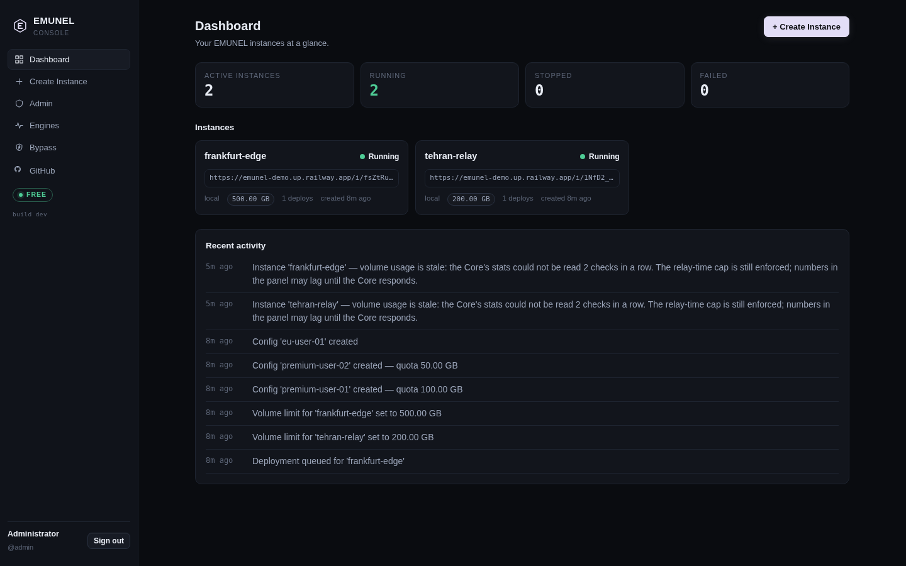
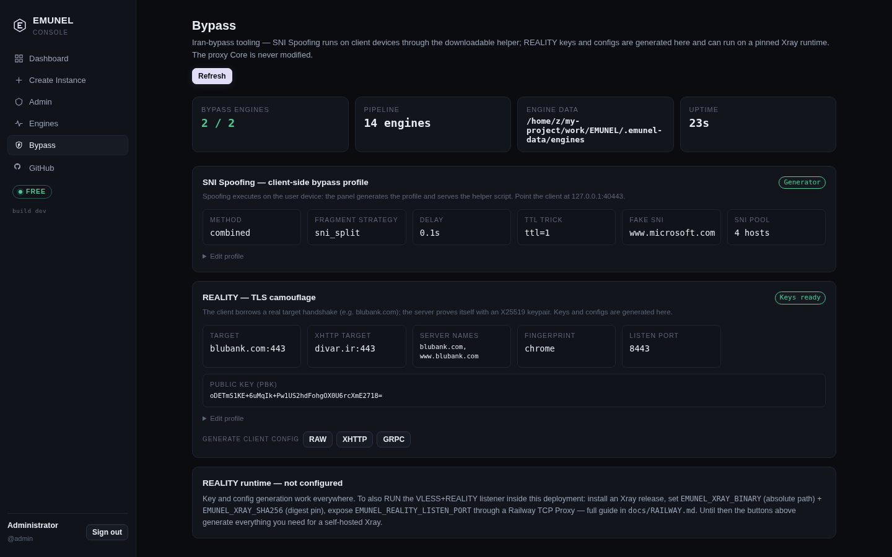
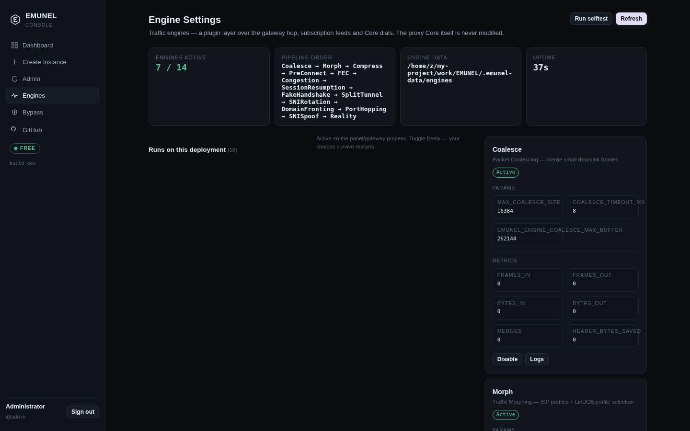
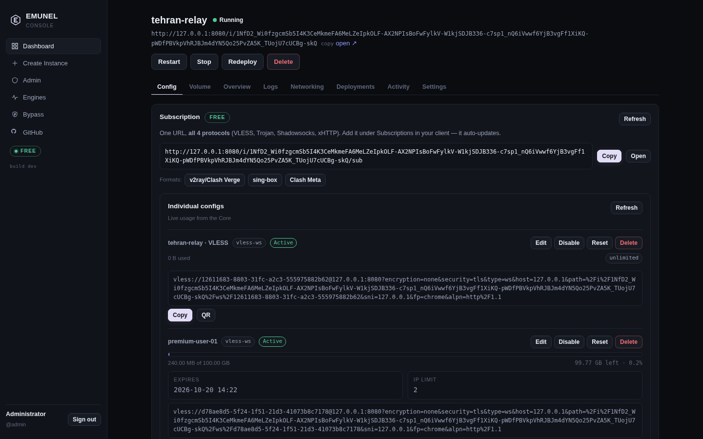

<div align="center">


# EMUNEL

**Self-hosted multi-protocol proxy platform — one button to deploy, one panel to rule it.**

[](docs/RAILWAY.md)
[](requirements.txt)
[](Dockerfile)
[](tests/)
[](LICENSE)

[Features](#-features) · [Screenshots](#-screenshots) · [Quick Start](#-quick-start) · [Bypass](#-bypass-toolbox) · [Docs](#-documentation)

</div>

---

EMUNEL gives you your own proxy **panel**: spin up isolated VLESS / Trojan / Shadowsocks / VMess instances behind a single HTTPS domain, hand out per-user configs with **quotas that actually hold**, and manage everything from a fast dark panel that works on your phone. No servers to babysit, no config files to edit — deploy to Railway in one click and you have a working `vless://` link in under a minute.

**Why it's different:** limits are enforced *inside the relay core at packet time* — not in a dashboard counter. Reset the container, kill the process, wipe the database: a user's spent quota stays spent (state is persisted and regression-repaired). This closes the classic "restart the panel, quota resets to zero" bypass.

<div align="center">



*The panel: two live instances, per-instance volume caps, share URLs and the activity feed — all real data, relayed through a real VLESS tunnel.*

</div>

---

## ✨ Features

**Traffic & configs**
- **8 protocols** — VLESS (WS + xHTTP), Trojan (WS + xHTTP), Shadowsocks-AEAD, VMess (pinned Xray runtime)
- **Per-config quotas, expiry, speed & IP limits** — enforced at relay time in the Core, persisted across restarts and redeploys
- **Instance volume caps** — checked *inside* the Core before every relayed frame; survives console blindness and state-file wipes
- **Subscription URLs** — one link per instance, v2ray / sing-box / Clash Meta formats, QR included
- **Single-port operation** — every instance is reachable through one HTTPS domain via endpoint-token routing (`/i/<token>/…`); no per-port exposure needed

**Bypass toolbox** *(Iran-focused, client-honest)*
- **SNI Spoofing** — panel generates the profile, client-side helper (`fragment` / `fake_sni` / `combined`, TTL trick, SNI rotation) does the spoofing; server never executes it
- **REALITY** — X25519 keypairs + RAW / xHTTP / gRPC inbound & outbound configs, optional pinned-Xray runtime
- **14 hot-toggle engines** — Coalesce, Morph, Compress, PreConnect, FEC, Congestion, SessionResumption, FakeHandshake, SplitTunnel, SNIRotation, DomainFronting, PortHopping, SNISpoof, Reality — toggles persist across restarts

**Operations**
- **Zero-config bootstrap** — embedded SQLite, auto-generated secrets, built-in `admin/admin` account; optional PostgreSQL + GitHub OAuth
- **Never-crash design** — degraded mode on DB failure, recovery loops, build-time import gates, healthchecks
- **Hardened** — rate limiting (429s, `/i/*` never limited), CSRF, JWT sessions, rlimit-isolated instances, atomic state writes
- **Mobile-first dark panel** — bottom nav on phones, overlap-guarded polling with exponential backoff, live logs / connections / metrics

## 📸 Screenshots

<div align="center">

| Bypass — SNI Spoofing & REALITY | Engine Settings — the 14-engine matrix |
|:---:|:---:|
|  |  |

</div>

<details>
<summary><b>More panel views</b></summary>

<div align="center">

| Configs — per-user quotas with live usage | Instance — status, volume, lifecycle |
|:---:|:---:|
|  |  |

</div>
</details>

## 🚀 Quick Start

**On Railway (recommended, ~2 minutes):**

1. **Fork** this repo → in Railway, **new service → from your fork's root** (Dockerfile is auto-detected).
2. **Generate a domain** → open it → sign in with **admin / admin** (change it in Admin → System).
3. **Create Instance → Deploy** → Config tab → copy your `vless://` link or subscription URL into any client (v2rayNG, NekoBox, Streisand, …).

That's it. No required variables — SQLite, secrets and the admin account are auto-provisioned. Attach a volume at `/data` so data survives redeploys, and optionally add `DATABASE_URL` (PostgreSQL) for production scale.

Full guides: [Railway](docs/RAILWAY.md) · [Deployment](docs/DEPLOYMENT.md) · [Docker Compose](deploy/docker/docker-compose.yml)

**Local:**

```bash
python3 -m venv .venv && .venv/bin/pip install -r requirements.txt
.venv/bin/python main.py          # → http://127.0.0.1:8080 (admin / admin)
```

**Run the test suite** (182 tests, no external services needed):

```bash
python3 -m pip install -r requirements.txt && python3 -m pytest tests/ -q
```

## 🧭 Bypass Toolbox

Single-port panels are already past the DPI (they terminate TLS at the platform edge) — so EMUNEL is honest about where bypassing happens: **on the client device**.

- The **SNI Spoofing** card generates a profile (fragment / fake_sni / combined, `sni_split` / `half` / `multi` / `tls_record_frag` strategies, TTL trick, SNI pool rotation, ±20% anti-fingerprint jitter) and serves a **downloadable stdlib-only helper script** — the same ClientHello logic the panel tests, byte-for-byte.
- The **REALITY** card generates X25519 keypairs and full inbound/outbound configs for RAW / xHTTP / gRPC, and can run a pinned Xray runtime (`EMUNEL_XRAY_BINARY` + SHA-256 pin — never downloaded, never group-writable).

Setup walkthroughs (helper usage, Railway TCP proxy, Xray pinning): [docs/RAILWAY.md](docs/RAILWAY.md).

## 🏗 Architecture

```
Browser ──HTTPS──▶ Railway edge ──▶ Console (FastAPI, panel + API + gateway)
                                        │  /i/<endpoint-token>/…  ──▶ Worker ──▶ Core (isolated process)
                                        │  /sub/<token>           ──▶ subscription feed
                                        └── Postgres / SQLite, volume service, link sync
```

Three moving parts, one repository: **Console** (control plane + gateway), **Worker** (node agent: process/Docker drivers, heartbeats), **Core** (per-instance isolated proxy runtime with quota enforcement). Deep dive: [docs/ARCHITECTURE.md](docs/ARCHITECTURE.md) · API reference: [docs/API.md](docs/API.md).

<details>
<summary><b>Repository layout</b></summary>

```
emunel/
├── core/emunel_core/     # proxy runtime: transports, links, quotas, state
├── console/              # API (FastAPI + PG/SQLite) + served panel
├── worker/               # node agent: drivers, heartbeat, ws-proxy
├── engines/              # 14-engine pipeline + SNI/REALITY + state store
├── docs/                 # architecture, API, security, deployment, Railway
├── tests/                # 182 tests: protocol, pipeline, stability, volume
├── Dockerfile            # single-service image (Railway-ready)
└── main.py              # one-process entrypoint: Console + Worker + Cores
```
</details>

## 📚 Documentation

| Doc | What's inside |
|---|---|
| [ARCHITECTURE.md](docs/ARCHITECTURE.md) | Components, request flow, data model, quota design |
| [API.md](docs/API.md) | Console + Core + Worker HTTP API reference |
| [SECURITY.md](docs/SECURITY.md) | Security model, threat decisions, reporting |
| [DEPLOYMENT.md](docs/DEPLOYMENT.md) | Managed platforms, Docker self-hosting, compose |
| [RAILWAY.md](docs/RAILWAY.md) | Railway guide: deploy, volumes, bypass, troubleshooting |
| [engines/README.md](engines/README.md) | Engine pipeline, Bypass section, env reference |

## 📄 License

EMUNEL's relay engine derives from the RVG Gateway relay engine by codebox (see the derived-work notice in [LICENSE](LICENSE)); the console/worker/deploy code is MIT.
